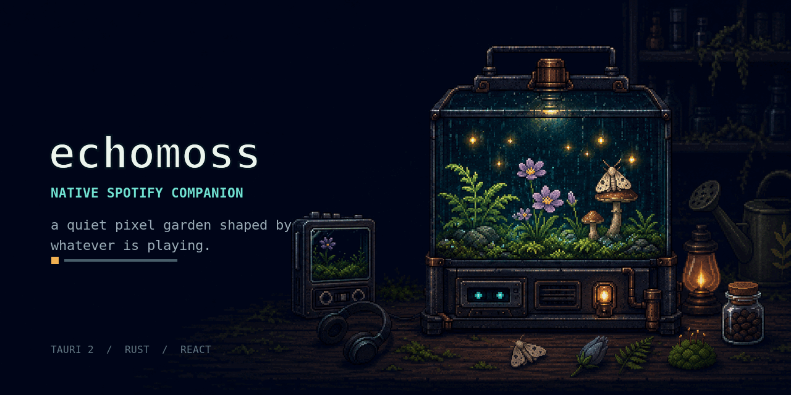

<div align="center">
  

# echomoss

**Every song leaves something growing.**

Native Windows app · Tauri 2 · Rust · Spotify Web API · React
</div>

<p align="center">
  <a href="./LICENSE"></a>
  
  
  
</p>

echomoss is a small desktop companion, not another streaming client. It reads playback
metadata through Spotify's official API and turns listening into a persistent botanical
habitat: tracks wake the moss, changes attract a moth, and completed songs leave new
specimens behind.

It also works without Spotify. The native app ships with a fictional local playlist so the
terrarium reactions can be explored immediately.

## What makes it different

- **One focused object.** The 360×400 popup is almost entirely terrarium, with no dashboard
  or permanent settings chrome.
- **Handmade pixel language.** Every visual belongs to one midnight botanical instrument.
- **Metadata-reactive, not audio-synced.** It responds to track, progress and play state; it
  never analyzes or visualizes Spotify's raw audio.
- **A real lightweight app.** Tauri opens echomoss in its own native window and uses the
  WebView2 runtime already present on modern Windows, so the project does not bundle a
  second browser engine.
- **Local by design.** Garden progress lives on the device; OAuth tokens are protected by
  Windows Credential Manager through Rust's system keyring.
- **No client secret in the app.** Authorization uses OAuth 2.0 Authorization Code with PKCE
  and a loopback callback.
- **Motion can rest.** The hidden settings drawer and the operating-system reduced-motion
  preference stop decorative animation.

## Current specimen

- Four-state terrarium: dormant, listening, track drift and bloom
- Low-frame-rate rain, lamp, firefly, moth and flower reactions
- Click/tap reaction with a tiny heart and pixel burst
- Track title, artwork and progress embedded inside the glass
- Persistent bloom, listening-time and specimen state
- Sixteen original botanical UI sprites
- Optional Spotify connection in the desktop build
- Playback controls routed through the Spotify Web API
- Frameless Tauri window backed by Rust commands
- Automated Windows NSIS installer build

## Run it

Requirements for source development on Windows:

- Node.js 20+ and npm
- Rust stable
- Microsoft C++ Build Tools with **Desktop development with C++**
- Microsoft Edge WebView2 Runtime, already included with current Windows 10 and Windows 11

```bash
npm install
npm run dev
```

`npm run dev` opens the native echomoss window. It does not open a browser tab.

`npm run dev:web` exists only as an optional visual preview for frontend development.

Quality checks:

```bash
npm run typecheck
npm run lint
npm test
npm run build:web
```

Create the native Windows installer:

```bash
npm run build
```

The setup executable is written to:

```text
src-tauri/target/release/bundle/nsis/
```

The included GitHub Actions workflow also produces a downloadable
`echomoss-windows` artifact on every push to `main`.

## Connect Spotify

1. Create an app in the [Spotify Developer Dashboard](https://developer.spotify.com/dashboard).
2. Add this exact redirect URI:

   ```text
   http://127.0.0.1:43821/callback
   ```

3. Start echomoss with `npm run dev`.
4. Open the tiny gear drawer and paste the app's **Client ID**.
5. Choose **Wake with Spotify** and approve the requested playback scopes.

Spotify Developer Mode access rules and account requirements may change. Check the
[official Web API documentation](https://developer.spotify.com/documentation/web-api) if an
account cannot be authorized.

### Requested scopes

- `user-read-playback-state`
- `user-read-currently-playing`
- `user-modify-playback-state`

The Client ID is stored locally. No client secret is requested or bundled. Access and
refresh tokens are kept in the operating-system credential vault rather than JavaScript
storage.

Spotify requires authorization to happen on its own secure Accounts page. Therefore the
default browser opens **only when you explicitly press Connect Spotify for the first
authorization**. Once approved, the refresh token in Windows Credential Manager lets
echomoss open directly as an app on later runs.

## Architecture

```text
echomoss/
├── src-tauri/
│   ├── src/lib.rs          # native window and Tauri command boundary
│   ├── src/spotify.rs      # PKCE, OS keyring and Spotify Web API
│   ├── icons/              # Windows and application bundle icons
│   └── tauri.conf.json     # native window and NSIS bundle settings
├── public/assets/          # production pixel-art sheets and app icon
├── src/
│   ├── components/         # reactive terrarium and hidden connection drawer
│   ├── hooks/              # demo/Spotify playback controller
│   └── lib/                # garden state, types and tests
├── docs/                   # preview and reproducible asset prompts
└── .github/workflows/      # validation and Windows installer build
```

Frontend code never receives Rust filesystem access or Spotify tokens. It invokes a narrow
set of typed Tauri commands and receives only normalized playback metadata.

## Visual state map

| Playback event           | Habitat response                    |
| ------------------------ | ----------------------------------- |
| Paused or no active item | Dormant night terrarium             |
| Playing                  | Cyan pulse and wandering fireflies  |
| Track changed early      | Moth crossing / drift state         |
| Track changed after 88%  | Full bloom and a new specimen       |
| Terrarium clicked        | Chibi wiggle, heart and pixel burst |

The response is intentionally low-frequency and state-based. echomoss is not an audio
visualizer.

## Roadmap

- Native tray controls and a compact always-on-top habitat mode
- Garden export/import
- More deterministic specimen families
- Local-file mode for user-owned audio experiments
- Signed Windows releases

## Assets

All project art is original and included in the repository:

- `public/assets/terrarium-states.png` — 2×2 habitat state sheet
- `public/assets/botanical-ui-sprites.png` — 4×4 transparent object sheet
- `public/assets/app-icon.png` — square desktop icon
- `src-tauri/icons/` — Windows and native bundle icons
- `docs/github-social-preview.png` — repository and link-sharing banner

The complete generation prompts and sprite order live in
[`docs/ASSET_PROMPTS.md`](./docs/ASSET_PROMPTS.md).

## Notes

echomoss is an independent experiment and is not affiliated with or endorsed by Spotify.
Spotify is a trademark of Spotify AB.

Released under the [MIT License](./LICENSE).
